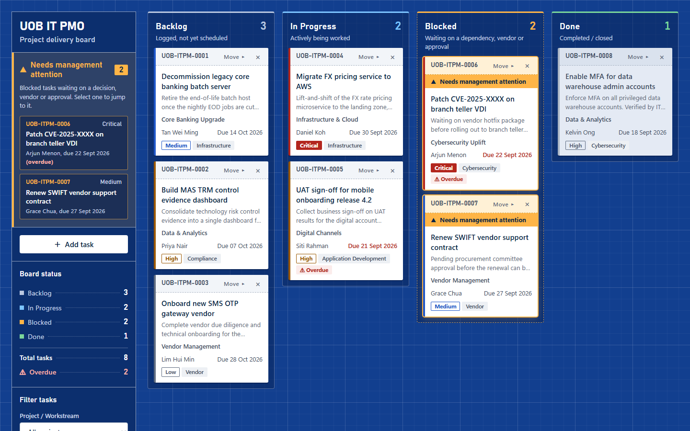

# IT PMO Kanban Board v2 (Demo)

A lightweight Kanban board for tracking IT project tasks, built as an internal demo and training tool for an IT project management office. It runs entirely in the browser from a single HTML file, with no dependencies, no build step, and no backend. Version 2 is a "project blueprint" redesign that flags blocked work for management attention.

> **Disclaimer:** This is an independent demo. It is not affiliated with, endorsed by, or an official system of UOB, and it uses no UOB logos or trademarks.

**Live demo:** https://garylty-gh.github.io/kanban4-v2/



The original design (v1) is at https://garylty-gh.github.io/kanban4/.

## Features

- **Four status lanes:** Backlog, In Progress, Blocked, and Done, each with a live task count.
- **Management attention for blocked work:** every Blocked task carries an amber "Needs management attention" flag. The sidebar lists all blocked tasks, most urgent first; selecting one jumps to its card.
- **Moving tasks:** drag and drop cards between lanes, or use the keyboard-friendly **Move ▸** menu on each card.
- **Add tasks:** a modal form with inline validation. New tasks get IDs in the form `UOB-ITPM-####`.
- **Email notification:** each new task sends a notification through [FormSubmit](https://formsubmit.co/). If sending fails, the task is kept and a warning is shown.
- **Filters:** by project or workstream, by assignee (text match), and by priority.
- **Board status:** totals per status across all tasks, plus the overdue count, in the sidebar.
- **Overdue detection:** tasks past their due date that are not Done are flagged. The seed data uses dates relative to today, so overdue examples always appear.
- **Priorities:** Critical, High, Medium, and Low, shown by colour and by text.
- **Inline delete confirmation:** "Delete? Yes / No" appears on the card, with no browser confirmation dialog.
- **Support hotline notice:** after 10 seconds on the page, a dialog thanks the visitor and gives the IT support hotline (1234 5678, a tap-to-call link on phones). It appears once per page load, waits if the Add task form is open, and closes with **Got it**, ×, Escape, or a click outside it.
- **Accessibility:** labelled inputs, visible focus rings, `aria-live` announcements, and full keyboard operation.
- **Responsive layout:** a sidebar with 4 lanes on wide screens, a 2×2 board on smaller desktops and tablets, and a single stacked column on phones.

## Design

The board is drawn as a project blueprint: a cobalt drafting grid, a sidebar styled as a drawing's title block, and tasks as white paper tickets. Blocked lanes use dashed lines, the drafting convention for pending work. Fonts are system fonts only: Bahnschrift (on Windows) for headings and numbers, and the platform UI font for body text.

## Running locally

Open `index.html` directly in a browser. That's all you need.

To test FormSubmit email delivery, serve the file over HTTP, because FormSubmit may reject requests from `file://`:

```bash
python -m http.server 8000
```

Then open http://localhost:8000/.

### Configuring email notifications

Set your address in the `FORMSUBMIT_ENDPOINT` constant at the top of the `<script>` block in `index.html`:

```js
const FORMSUBMIT_ENDPOINT = "https://formsubmit.co/ajax/you@example.com";
```

FormSubmit sends a one-time activation email to that address the first time it is used. Any address you put here is public once the site is published.

### Configuring the support notice

The delay is set by `HELP_NOTICE_DELAY_MS` at the top of the `<script>` block (default `10000`, in milliseconds). The hotline number and wording are in the `#help-backdrop` markup, just above the toast region in `index.html`.

## No persistence

Nothing is saved: the board does not use localStorage, cookies, or a server. Refreshing the page resets the board to the seed data. This is intentional for a demo and training tool.

## Tech notes

- A single `index.html` file with vanilla HTML, CSS, and JavaScript.
- No frameworks, libraries, CDN scripts, web fonts, or images in the app. Icons are Unicode or inline SVG.
- The only network request is the FormSubmit notification.

## Deployment

The site is published to GitHub Pages by the workflow in [`.github/workflows/pages.yml`](.github/workflows/pages.yml) on every push to `main`. Only `index.html` is deployed.
